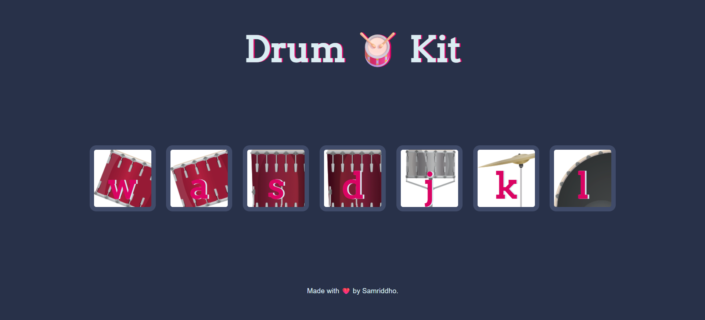

# 🥁 Drum Kit

An interactive web-based Drum Kit application built using **HTML, CSS, and JavaScript**. Users can play different drum sounds either by clicking the on-screen drum buttons or by pressing the corresponding keys on their keyboard, creating a fun and engaging musical experience.

---

## 📸 Preview



---

## 🚀 Features

* 🎵 Play multiple drum sounds using keyboard inputs
* 🖱️ Trigger sounds through mouse clicks
* ✨ Interactive button press animations
* 🔊 Instant audio feedback for an immersive experience
* 📱 Responsive and user-friendly interface
* ⚡ Lightweight and easy to run locally

---

## 🛠️ Tech Stack

* **HTML5** – Structure and layout
* **CSS3** – Styling and animations
* **JavaScript (ES6)** – Event handling and sound playback

---

## 📂 Project Structure

```text
Drum-Kit/
├── index.html
├── styles.css
├── index.js
├── sounds/
│   ├── tom-1.mp3
│   ├── tom-2.mp3
│   ├── tom-3.mp3
│   ├── tom-4.mp3
│   ├── snare.mp3
│   ├── kick-bass.mp3
│   └── crash.mp3
├── images/
└── Screenshot1.png
```

---

## 🎹 Controls

| Key | Sound     |
| --- | --------- |
| W   | Tom 1     |
| A   | Tom 2     |
| S   | Tom 3     |
| D   | Tom 4     |
| J   | Snare     |
| K   | Crash     |
| L   | Kick Bass |

You can either press the corresponding keyboard key or click the drum button on the screen.

---

## ⚙️ Getting Started

### 1. Clone the Repository

```bash
git clone https://github.com/YOUR_USERNAME/Drum-Kit.git
```

### 2. Navigate to the Project Directory

```bash
cd Drum-Kit
```

### 3. Run the Application

Simply open `index.html` in your preferred web browser.

---

## 🎯 Learning Outcomes

This project helped in understanding:

* DOM Manipulation
* Event Listeners
* Keyboard and Mouse Events
* Audio Playback using JavaScript
* Dynamic UI Interactions
* Basic Frontend Development Concepts

---

## 🌟 Future Improvements

* Add more drum kits and sound packs
* Volume control functionality
* Recording and playback feature
* Mobile-friendly enhancements
* Custom keyboard mappings

---
